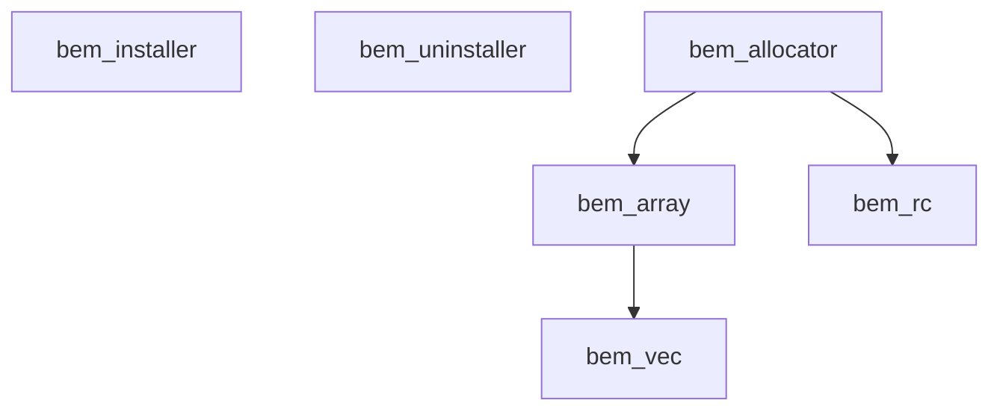

# <samp>bem</samp>

<samp>bem</samp> provides random access memory and allocator backed by block entities.

## Modules

| Name                                                                             | Description                               |
| :------------------------------------------------------------------------------- | :---------------------------------------- |
| [`bem_installer`](https://github.com/intsuc/bem/tree/main/bem_installer.zip)     | Installer for <samp>bem</samp>            |
| [`bem_uninstaller`](https://github.com/intsuc/bem/tree/main/bem_uninstaller.zip) | Uninstaller for <samp>bem</samp>          |
| [`bem_allocator`](https://github.com/intsuc/bem/tree/main/bem_allocator.zip)     | Random access memory and memory allocator |
| [`bem_array`](https://github.com/intsuc/bem/tree/main/bem_array.zip)             | Fixed-size array                          |
| [`bem_vec`](https://github.com/intsuc/bem/tree/main/bem_vec.zip)                 | Growable array                            |
| [`bem_rc`](https://github.com/intsuc/bem/tree/main/bem_rc.zip)                   | Reference-counting pointer                |

## Dependency graph

