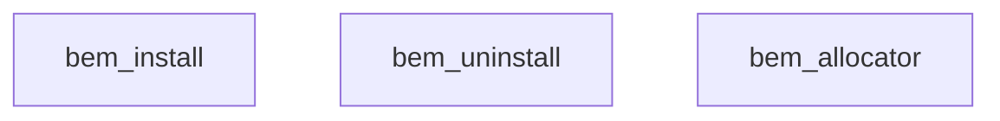

# <samp>bem</samp>

<samp>bem</samp> provides random access memory and allocator backed by block entities.

## Dependency graph

```mermaid
flowchart TD
  bem_install
  bem_uninstall
  bem_allocator
```
